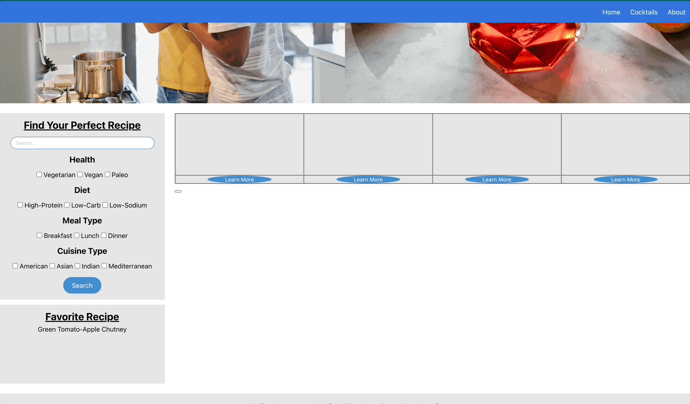

# Date Night Bites

## Project Summary

[Date Night Bites](https://lilyannekot.github.io/date-night-bites/) is your new go-to for finding new and exciting recipes to cook with your loved ones. Select from 13 different filters including health preferences, diet, meal type, and cuisine type to specify your recipe search. Click "Learn More" on a recipe to view ingredients and save your favorite dish. To include some spontaneity, find a randomly generated beverage to go with your selected meal.

## Languages and Technology Used

* **HTML**
* **CSS**
* **JavaScript**
* **jQuery:** JavaScript library used for event handling and Ajax requests
* **Moment:** JavaScript library used for parsing, validating, manipulating, and displaying the date/time
* **Parsley:** 
* **Bulma:** CSS Framework
* **Edamam Recipe API:** API for recipe information and images 
* **TheCocktailDB:** API for cocktail recipes

# Project Demonstration


# User Story Demonstration

"As a user, once I apply the filters, I want to see a table of possible recipes so that I can pick one that meets my filters."



"As a user, I want to click on learn more, so more relevant recipe information is displayed.


```
function button0Call(){
    var recipeURL = tableArr[0]
    console.log(recipeURL)
    $.ajax({
        url: recipeURL,
        method: 'GET',
    }).then(function (response){
        var recLabel0 = response.recipe.label
        console.log("recipe content", recLabel0)
        var recipeImg0 = response.recipe.images.REGULAR.url
        console.log("recipe image 0", recipeImg0)
        var recipeIngredientLines0 = response.recipe.ingredientLines
        console.log(recipeIngredientLines0)
        var recipeCalories0 = response.recipe.calories
        recipeCalories0 = Math.floor(recipeCalories0)
        console.log(recipeCalories0)
        var recipeTotalTime0 = response.recipe.totalTime 
        console.log(recipeTotalTime0)
        var btnURL0 = response.recipe.shareAs
        console.log(btnURL0)
        generateBtn0(recLabel0, recipeImg0, recipeIngredientLines0, recipeCalories0, recipeTotalTime0, btnURL0)
``` 
# CSS Framework - Bulma

[Bulma](https://bulma.io/documentation/) is a free, open source framework that provides ready-to-use frontend components that you can use to build responsive.


# Learning Objectives

The goal was to learn new API's and apply them with a concept we developed as a group. Learning API's understanding server-side requests and formatting the data was a challenge but an amazing learning experience.

# Additional Code Snippet

Here's an example of how we were able to generate the title of the recipe under the favorites section on the website. The recipe title, is also stored locally.

```
var localFav = document.getElementById("localFav")
favload();
var favloc = document.querySelector("#FavBtn")
function favload(){
    var favMeals = localStorage.getItem("favMeals")
    var fav = JSON.parse(favMeals)
    favP.textContent = fav
}
function makeFav(event){
    var element = event.target
    var favData = element.getAttribute("data-target")
    favData = JSON.stringify(favData)
    localStorage.setItem("favMeals", favData)
    favload();
}
favloc.addEventListener("click", makeFav)
```

# Author Links

* [Jonathan Mengel Github](https://github.com/digggggg)
* [Tim Sasse Github](https://github.com/timcs1274)
* [Lily Kot Github](https://github.com/lilyannekot)
